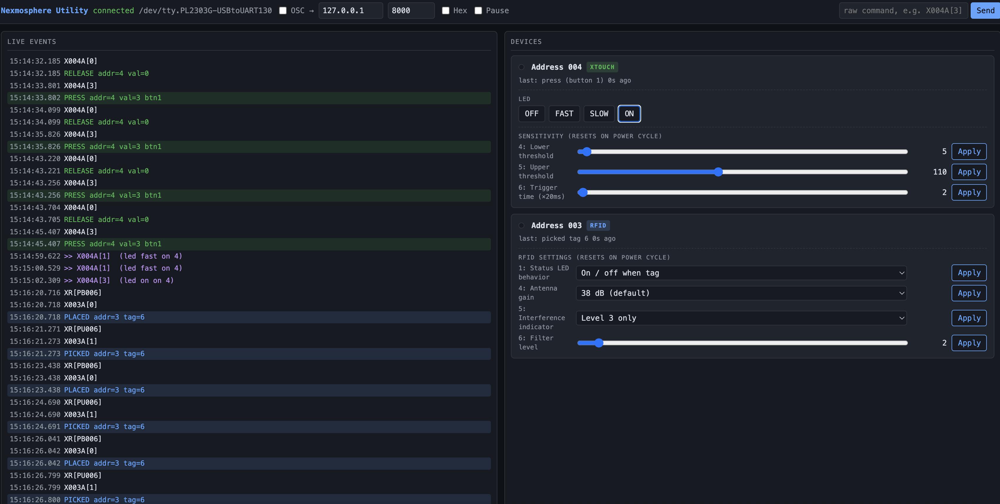

# Nexmosphere Utility

A small on-site web tool for testing and configuring Nexmosphere XN-series controllers, XT touch buttons, and XR RFID antennas. Plug the controller into USB, run `npm start`, open the URL it prints. Live event stream on the left, per-device controls on the right.



## Hardware tested

- **XN-145** USB X-Talk interface — Prolific PL2303 (vendor `0x067B`).
- **XT-1GW6** large single-button capacitive touch (with LED).
- **XR-DR1** RFID driver + **XR-A50** antenna (parser scaffolded; format matches the Nexmosphere "XR Range RFID" manual, see `docs/`).

The auto-detect heuristic also accepts FTDI, Silicon Labs CP210x, and WCH CH340 USB-serial chips by vendor ID.

## macOS setup note

Prolific PL2303 chips need Prolific's macOS driver — macOS does not ship a working built-in one. Install the v2 DriverKit (`.dext`) version from prolific.com.tw, then enable it in **System Settings → General → Login Items & Extensions → Driver Extensions**. After enabling, a `/dev/tty.PL2303G-USBtoUART*` node appears.

Verify with:

```sh
systemextensionsctl list | grep -i prolific      # should show: enabled * active *
ls /dev/tty.PL2303G-USBtoUART*                   # should list a node
```

## Run

```sh
npm install
npm start
```

Output:

```
[hh:mm:ss] Serial: /dev/tty.PL2303G-USBtoUART110 @ 115200 8N1
[hh:mm:ss] Web UI: http://127.0.0.1:3000
```

Open the URL. Touch your button — events flash in the log and a card appears for the address.

### Flags

- `--port <web-port>` — default `3000`. Or set `PORT` env var.
- `--host <bind-host>` — default `127.0.0.1`.
- `--device <devpath>` — skip auto-detect, e.g. `--device /dev/tty.PL2303G-USBtoUART110`.

## What you can do from the UI

- **Live log**: every parsed event (touch press/release, RFID picked/placed) plus a "raw bytes" toggle for hex inspection.
- **XT card** (per address that emits touch events):
  - **LED control**: Off / Fast blink / Slow blink / On (XT-1GW6 single LED).
  - **Sensitivity**: settings 4 (lower threshold), 5 (upper threshold), 6 (trigger time × 20ms). Slide and click Apply.
- **RFID card** (per antenna address):
  - **Status LED behavior**, **antenna gain** (5 levels), **interference indicator**, **filter level** (1–20).
- **Raw send**: textbox at the top accepts arbitrary X-Talk commands like `X004A[3]`. Settings persist until power-cycle.

## OSC (optional)

Flip the **OSC** checkbox in the top bar (default destination `127.0.0.1:8000`). Parsed events fan out as:

```
/nexmosphere/<addr>/press     <int value>
/nexmosphere/<addr>/release   <int value>
/nexmosphere/<addr>/picked    <int tag>
/nexmosphere/<addr>/placed    <int tag>
```

Quick listener in another terminal (uses the same `osc` lib already in `node_modules/`):

```sh
node -e "const osc=require('osc'); const u=new osc.UDPPort({localAddress:'0.0.0.0',localPort:8000,metadata:false}); u.on('message',m=>console.log(m.address,m.args)); u.open();"
```

## Layout

```
src/
  server.js         http + ws + serial wiring
  serial.js         port detect, open, write
  registry.js       in-memory addr → device state
  osc-out.js        UDP OSC sender
  devices/
    xtouch.js       parse touch + format LED/settings commands
    rfid.js         pair XR[PU/PB] with X<addr>A[1/0]; format settings
public/
  index.html  app.js  style.css
docs/
  XT-Touch-buttons-manual.pdf
  XR-Range-RFID-manual.pdf
```

## Protocol notes (gathered from manuals + bench testing)

- **Baud**: 115200 8N1.
- **Command terminator**: bare CR (`\r`). CRLF is also accepted on the device side; replies arrive with CRLF.
- **Touch event**: `X<addr>A[<v>]` — `0`=release, `3`=button1, `5`=button2, `9`=button3, `17`=button4 (per XT manual, page 2).
- **LED command**: same form, opposite direction. `X<addr>A[<v>]` writes the LED state (`0`=off, `1`=fast blink, `2`=slow blink, `3`=on for single-LED). Multi-LED packing is documented in the XT manual appendix.
- **Settings**: `X<addr>S[<n>:<v>]`, reset on power cycle.
- **RFID pickup**: two consecutive lines — `XR[PU<nnn>]` then `X<addr>A[1]`. Placeback: `XR[PB<nnn>]` then `X<addr>A[0]`. The antenna line shares format with touch release, which is why this app pairs them with a 500 ms window before deciding which device fired.

## Acknowledgements

Protocol-parsing patterns (touch / RFID / setting message formats) were originally extracted from the [@signageos/nexmosphere-sdk-js](https://github.com/signageos/nexmosphere-sdk-js) library by signageOS (MIT). This project re-implements those patterns in plain JavaScript inside a small web utility — it is not a fork of the SDK and does not ship signageOS code.

## License

MIT — see [LICENSE](./LICENSE).
